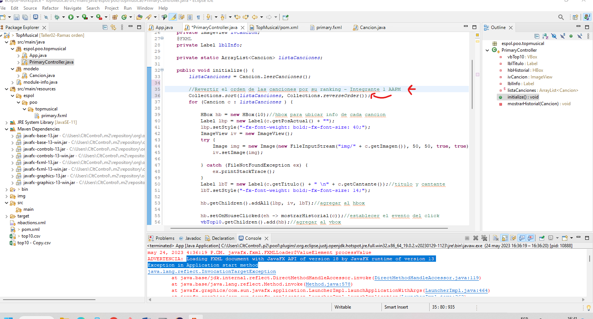

# Taller02-Ramas

## Lider
- Kevin Zhang 

## Parte 2 - Creando Ramas

## Resultado Integrante 1 - Captura de orden top 10 descendente

Como la interfaz no compiló debido a un problema de versiones del java y debido a la falta de tiempo,
solo se realizó el cambio en el código para cumplir el propósito de la práctica

## Integrante 3

